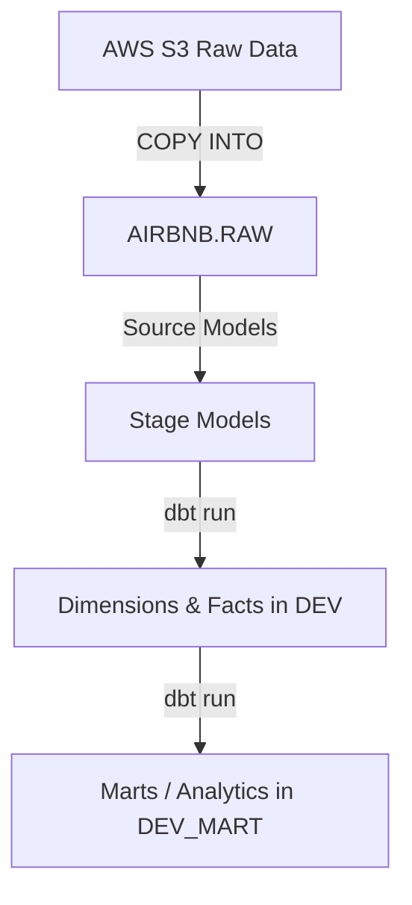

# Airbnb dbt Analytics Project

A modern, production-grade dbt (Data Build Tool) project focused on transforming raw Airbnb datasets hosted on AWS S3 and performing analytics inside a Snowflake Data Warehouse.

This project implements analytics engineering best practices, including schema design, incremental materialization, tests, custom macros, documentation, and metadata logging.

## Tech Stack
- **Data Build Tool (dbt)**: Core data transformation framework.
- **Snowflake**: Cloud data warehouse storing raw data and analytics-ready schemas.
- **AWS S3**: Raw CSV source data storage.

---

## Project Structure

The repository contains the following core components inside the `airbnb` directory:

- `models/`: The SQL transformation models representing dimensions (`dim`), facts (`fct`), and marts (`mart`).
- `seeds/`: Static CSV files containing seed data (e.g., full moon dates to correlate review sentiment).
- `macros/`: Reusable Jinja SQL templates (e.g., custom logging, variable injection).
- `snapshots/`: Snapshot tables implementing Slowly Changing Dimensions (SCD Type 2) to track host and listing changes over time.
- `tests/`: Custom SQL data quality assertions.

---

## Getting Started

### Prerequisites

Ensure you have Python installed, then set up the virtual environment:

```bash
# Activate python virtual environment
source .venv/bin/activate

# Navigate into the dbt project folder
cd airbnb
```

### Run dbt Commands

```bash
# 1. Test your Snowflake connection
dbt debug

# 2. Install package dependencies
dbt deps

# 3. Load static seed data to Snowflake
dbt seed

# 4. Build and materialize all models
dbt run

# 5. Run data quality and integrity tests
dbt test

# 6. Generate and launch interactive documentation
dbt docs generate
dbt docs serve
```

---

## Architecture and Data Flow



- **RAW Schema**: Stores `raw_listings`, `raw_reviews`, and `raw_hosts`.
- **DEV Schema**: Stores sanitized, cleansed, and unified dimension/fact tables (`dim_listings_cleansed`, `dim_listings_w_hosts`, `fct_reviews`).
- **DEV_MART Schema**: Stores analytical models like `mart_fullmoon_reviews`.

---
Created and maintained by [Likith](https://github.com/lslikith).
